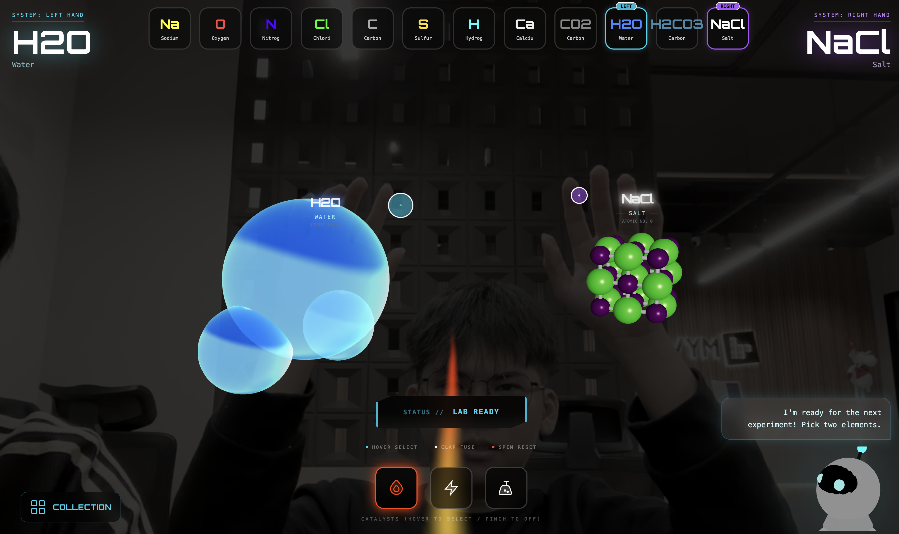

# 2nd Place in Cursor x Anthropic Hackathon Malaysia

<h2>Atomis — The J.A.R.V.I.S of Chemistry</h2>

Atomis is an interactive chemistry exploration platform that transforms the way students learn chemistry. Instead of relying on traditional methods such as flashcards, lectures, and static quizzes, Atomis introduces an immersive 3D environment where users can manipulate elements, fuse compounds, and engage with a chemistry-focused AI assistant.

## Problem

Traditional chemistry learning methods have remained largely unchanged for the past century. Students often find chemistry abstract, complex, and lacking real interactivity. Understanding element behavior and compound formation requires visualization and hands-on experimentation that classrooms rarely provide.

Atomis addresses this gap by offering a fully interactive 3D simulation where learners can explore the periodic table, combine elements to form compounds, and understand chemical properties through immersive interaction.

Slides: https://shorturl.at/riLUZ

## Features

### Interactive 3D Periodic Table

Navigate and explore elements in real-time through a dynamic Three.js-powered interface.

### Element Combination System

Select and combine elements to create new compounds. Successful combinations result in new discoveries, while incorrect combinations lead to simulated lab failures.

### Intelligent Chemistry Assistant

Chat with Atom, the platform's AI assistant, to learn about elements, reactions, compound properties, and chemical principles.

### Catalyst Selection

Choose the appropriate catalyst to initiate a reaction. Available catalysts include:

- **Light** - Photochemical reactions
- **Heat** - Thermal reactions
- **Chemical** - Chemical agents

Selecting the wrong catalyst will cause the reaction to fail and the lab to explode.

### Gesture-Based Interaction

Powered by MediaPipe, Atomis supports natural hand-based controls:

- Hover an element to inspect it
- Open or close your palm to zoom
- Clap your hands to trigger reactions
- Close both hands to add a compound to your personal shelf

## How It Works

1. Select up to eight elements before entering the laboratory environment
2. Hover over elements using hand-tracking to inspect their details
3. Use open/close palm gestures to zoom in or out of an element
4. Choose a catalyst required for the reaction
5. Clap your hands to activate the reaction
6. View the resulting compound generated in the 3D lab
7. Close both hands to store the compound in your shelf for later review

**Note:** Incorrect combinations or catalyst selections result in a simulated lab explosion.

## Tech Stack

- **React** - Frontend framework
- **Three.js** - 3D graphics library
- **React Three Fiber** - React renderer for Three.js
- **React Three Drei** - Useful helpers for React Three Fiber
- **Tailwind CSS** - Utility-first CSS framework
- **MediaPipe** - Hand tracking and gesture recognition
- **Convex** - Backend database and serverless functions
- **Vercel** - Deployment platform
